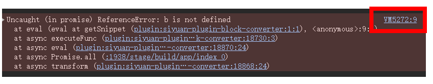

# 块转换工具

❗❗0.4.0版本开始，插件不再支持旧版本的脚本，以支持更多功能，请阅读说明。
🚀 实验性功能基本上都使用了一些未公开的 API，所以可能存在不稳定的情况，请谨慎使用。

[English](./README_en_US.md)

[更新日志](./CHANGELOG.md)

使用自定义代码进行复制、粘贴和更新操作，以块为单位进行操作，目前包含以下组件：

- 自定义块粘贴：将剪贴板内 html 粘贴至思源笔记，支持自定义转化为 Markdown 规则，针对表格做了优化。
- 自定义块复制：复制块时将把块内容按指定方法处理后再写入剪贴板。
- 自定义块更新：使用自定义代码处理块内容并更新。

## 自定义块粘贴

将剪贴板内 html 粘贴至思源笔记，与普通粘贴的不同在于，针对表格做了优化，另外，使用[mixmark-io/turndown: 🛏 An HTML to Markdown converter written in JavaScript (github.com)](https://github.com/mixmark-io/turndown)而不是 Lute 作为 html 转 markdown 工具。

### 使用方法

1. 在插件设置中设置 js 代码所在文档。
2. 在上述文档中编写 js 代码。
3. 点击粘贴位置处块的块标->插件->自定义粘贴

js 代码应该具有如下形式，关于 filter 和 replacement 的详细描述，参见[turndown 文档](https://github.com/mixmark-io/turndown)。

```js
{
  filter: function (node, options) {
    const fontSize = node.style.fontSize;
    const fontSizeNum = parseInt(fontSize);
    return fontSizeNum >= 22;
  },
  replacement: function (content, node, options) {
    return "# " + content;
  },
};
```

## 自定义块复制

在思源中编写 js 代码，复制块时将把块内容按指定方法处理后再写入剪贴板。

> ❗ 函数内容可访问全局变量，请注意风险。

### 使用方法

1. 在插件设置中设置 js 代码所在文档。
2. 在上述文档中编写 js 代码，代码片段是函数的主体部分（无须`return`语句）。
   - 必须使用代码块，并明确表示是 js 代码
   - 可以给块设置‘命名’以方便区分
3. 刷新界面(控制台运行`location.reload()`，即不支持热更新)
   - v0.2.4 以上版本：如果是已有脚本，则支持热更新，不用再刷新界面，但块标菜单显示不会更新
4. 点击要复制的块的块标 -> 插件 -> 自定义复制

### 函数相关

#### 参数与返回值

函数的入参和返回值一致，具体如下：

```ts
/**
 * 自定义函数输入参数1 : input，选择的块信息
 */
interface IInput {
  block: Block; //当前块，见 用户指南/请从这里开始/搜索进阶/数据库表
  extra: {
    title: string; //当前文档标题
    attrs: { [key: string]: string }; //当前块属性
  };
  index: number; //当前块索引
  array: Block[]; //选择的所有块
  isDelete: boolean; //是否删除，默认为false
}

/**
 * 自定义函数输入参数2: tools，工具函数
 */
interface ITools {
  [key: string]: any;
}
/**
 * 自定义函数输入参数3: output，输出，默认为原块的Markdown内容
 */
type IOutput = string; //Markdown文本
```

#### 调用其他 js 脚本

```js
async function executeFunc(
  input: IFuncInput,
  tools: ITools,
  output: string,
  jsBlock: {
    id?: string;//拟调用的js块id
    name?: string;//拟调用的js块命名
    content?: string;//拟调用的js块内容，一般使用不到
}): Promise<{
    input: IFuncInput;
    tools: ITools;
    output: string;
}>
```

#### tools 上提供的函数

- lute，注意与`window.Lute`不同，为编辑器内使用的 Lute 实例（而非 Lute 类,不需要调用 Lute.New()），具体使用方法参见[思源社区文档](https://docs.siyuan-note.club/zh-Hans/reference/api/plugin/class/Lute.html)。
- [prettier](https://prettier.io/):代码格式化工具，为了在编辑器中使用，使用方法与官方文档稍有不同，如：
  ```js
  await tools.prettier.prettier.format("foo();", {
    parser: "babel",
    plugins: [
      tools.prettier.prettierPluginBabel,
      tools.prettier.prettierPluginEstree,
    ],
  });
  ```

### 其他特性

- 支持设置自定义快捷键（v0.2.6）
- 函数为异步方法，支持`await`
- 超时时间 5s，超时后自动刷新界面，以防止卡死、死循环等问题
- 错误提示消息将在超时后弹出，而不是出现错误后立即出现提示，可在如下位置定位错误语句
  

## 自定义块更新

在思源中编写 js 代码，使用该代码处理块内容并更新。

> ❗ 无论如何，使用脚本更新块都有一定的风险，请使用多个块测试没有问题后再使用该工具进行更新，并推荐对待更新内容进行备份。
>
> ❗ 函数内容可访问全局变量，请注意风险。

### 使用方法

基本同[自定义块复制](#自定义块复制)，有以下不同：

- `input.extra.attr` 表示更新后的属性
- 返回`input.isDelete`为 `true` 时，则会删除该块
  ~~- 注意，由于`output`有内容才会对块进行处理，所以，若要删除该块，需要返回`output`不为空~~
  - 所选块的第一个块不能被删除
- 可以点击文档标题处的块标->插件->自定义更新，这样会更新整个文档(🚀 实验性)

### ⚠️ 注意事项

- 可以将一个块更新为多个块（如返回的Markdown内容有多个段落），但只有第一个块会继承或更新属性
- v0.2.4 以上版本：新增 `inputArray` 变量(详见 自定义块复制 部分)，可以利用其将多个块更新为一个块，但是如果任何块返回 `output` 内容为空，为保证数据安全，不会主动将其清空
- v0.2.6 以上版本：支持`Ctrl+Z`撤销(🚀 实验性)
