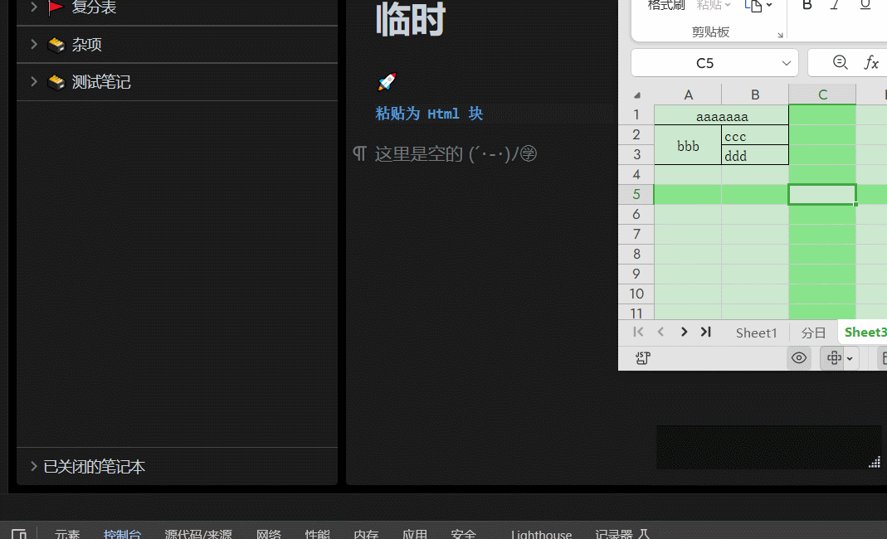

# 块转换工具

[English](./README_en_US.md)

[更新日志](./CHANGELOG.md)

提供一系列与块转换有关（或者说通过块标菜单触发）的工具，目前包含以下组件：

- 自定义块粘贴：将剪贴板内 html 粘贴至思源笔记，针对表格做了优化。
- 自定义块复制：在思源中编写 js 代码，复制块时将把块内容按指定方法处理后再写入剪贴板。
- 自定义块更新：在思源中编写 js 代码，使用该代码处理块内容并更新。
- 表格插入助手：将 html 类型的表格块转换为思源内置表格块。（计划移除）
- 粘贴为 Html 块：将剪贴板中内容粘贴为 Html 块。（计划移除）
- ~~流程图生成器：将块引用形式的流程转换为 Mermaid 流程图。~~（已移除）

## 自定义块粘贴

将剪贴板内 html 粘贴至思源笔记，与普通粘贴的不同在于，针对表格做了优化（后续可能会继续添加其他方面的优化），另外，使用[mixmark-io/turndown: 🛏 An HTML to Markdown converter written in JavaScript (github.com)](https://github.com/mixmark-io/turndown)而不是 Lute 作为 html 转 markdown 工具。

## 表格插入助手

将 html 类型的表格块转换为思源内置表格块。

### 使用方法

1. 新建 html 块，在其中粘贴表格 html 代码（必须含有`<table>`标签）
2. 点击块标 -> 插件 -> 转换为思源表格
3. 转换后的表格将插入在步骤 1 新建的 html 之后

- Q : 是否支持 Word、Excel 中的表格？
- A : 不支持，上述文件均可以另存为 html 文件

## 自定义块复制

在思源中编写 js 代码，复制块时将把块内容按指定方法处理后再写入剪贴板。

> ❗ 函数内容可访问全局变量，请注意风险。

### 使用方法

1. 在插件设置中设置 js 代码所在文档。
2. 在上述文档中编写 js 代码。
   - 必须要有 return 语句
   - 必须使用代码块，并明确表示是 js 代码
   - 可以给块设置‘命名’以方便区分
   - 支持直接使用的字段：
     - id: 块 Id
     - title：块所在文档名
     - name：块命名
     - markdown：块 markdow 文本
     - content：块文本，去除了 markdown 标记
     - input：整个 block 信息，详见思源笔记用户指南/请从这里开始/搜索进阶/数据库表
     - index: 复制多个块时，块索引，内部使用`result += func(input, i);`对内容进行拼接(`func(input, i)`为本步骤中编写的 js 代码)
     - inputArray(v0.2.4 新增): 复制多个块时，包含所有块`input`的列表
3. 刷新界面(控制台运行`location.reload()`，即不支持热更新)
   - v0.2.4 以上版本：如果是已有脚本，则支持热更新，不用再刷新界面，但块标菜单显示不会更新
4. 点击要复制的块的块标->插件->自定义复制

- v0.2.6 以上版本：支持设置自定义快捷键
- 函数内`Lute`与`window.Lute`不同，为编辑器内使用的Lute实例（而非Lute类,不需要调用Lute.New()）

### 内部实现

```js
//block js 代码所在块
const func = new Function(
  "input",
  "index",
  "inputArray",
  ` 
  let { title, name, content, markdown,id } = input;
  ${block.content}
  `
);
```

### 示例

以下代码将试图返回一个`((20230402121202-gofgg1n '《民诉解释》第374条'))`形式的文本并写入剪贴板。

```js
const matchGroup = content.match(/(第)(.*?)(条)/);
let realTitle = input.hpath.match(/《.*?》/);
if (!realTitle) {
  realTitle = title;
}
let result = "";
if (matchGroup) {
  result = `((${id} '${realTitle}${matchGroup[1]}${chineseToNum(
    matchGroup[2]
  )}${matchGroup[3]}'))`;
} else {
  result = `((${id} '${realTitle}${content.substring(0, 5)}'))`;
}

return result;

function chineseToNum(chnStr) {
  //该函数内容省略
}
```


## 自定义块更新

在思源中编写 js 代码，使用该代码处理块内容并更新。

> ❗ 无论如何，使用脚本更新块都有一定的风险，请使用多个块测试没有问题后再使用该工具进行更新，并推荐对待更新内容进行备份。
>
> ❗ 函数内容可访问全局变量，请注意风险。

### 使用方法

基本同自定义块复制，注意，返回值格式如下：

```js
{
  markdown?: string;
  attrs?: { [key: string]: string };
};
```

其中，markdown 表示更新后的块内容，attr 表示更新后的属性。

> ⚠️ 注意事项：
>
> - 可以将一个块更新为多个块，但只有第一个块会继承或更新属性
> - v0.2.4 以上版本：新增 `inputArray` 变量(详见 自定义块复制 部分)，可以利用其将多个块更新为一个块，但是如果任何块返回 `markdown` 内容为空，为保证数据安全，不会主动将其清空
> - v0.2.6 以上版本：支持`Ctrl+Z`撤销(🚀 实验性)

### 示例

#### 示例 1：将段落块转换为多级列表

以下代码将把文本块按一定规则转化为列表块，并清除原有的别名和命名。

```js
const list = markdown.split("\n");
let result = "";
let i = 0;
for (const text of list) {
  let textResult = i ? text : text.replace(/(第.{1,6}条)/, "**$1** ");
  textResult = "- " + textResult;
  if (text.startsWith("(") || text.startsWith("（")) {
    textResult = "  " + textResult;
  }
  result += "\r\n" + textResult;
  i++;
}
result = result + "\r\n---\r\n";
return { markdown: result, attrs: { name: "", alias: "" } };
```


#### 示例 2：作为模板使用

以下代码生成一个嵌入块，该嵌入块将汇总其父级块的所有反向链接。

```js
return {
  markdown: `{{SELECT * FROM blocks WHERE id IN(SELECT block_id FROM refs WHERE def_block_id='${input.parent_id}')}}`,
};
```

## 粘贴为 HTML 块

将剪贴板中内容粘贴为 HTML 块。

> 🚀 这是一项实验性功能。

Windows 剪切板可以存储多种格式的内容。如复制 Excel 中一部分表格，剪贴板中将会有制表符分隔文本、HTML 文本、png 格式图片三种类型，该组件捕获 HTML 文本并将其写入一个 HTML 块。

### 使用方法

点击块标 -> 插件 -> 粘贴为 HTML 块

### 示例


